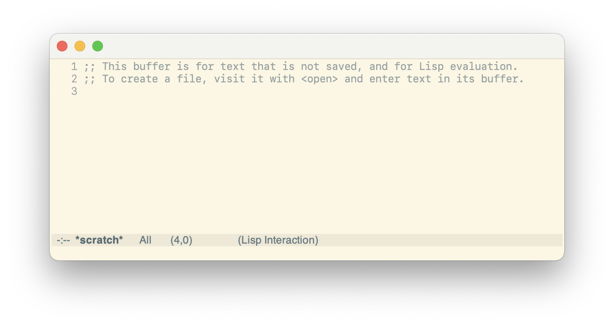

# My Emacs Configuration



## Install Configuration

To install the configuration on GNU/Linux or Darwin, just run the
following:

```bash
./install.sh
```

If your on Windows, run:

```batch
install.bat
```

## Fonts

For macOS and GNU/Linux, Apple's [SF
Mono](https://developer.apple.com/fonts/) font is used and for Window
[Fira Code](https://github.com/tonsky/FiraCode) is configured as
default font. To install a font from a disk image on GNU/Linux, run
the following:

```bash
# unpack the disk image
7z -o SF-Mono x SF-Mono.dmg
# extract the package
7z -o Payload x SF-Mono/**/*.pkg
7z x Payload/*
# now you can install the font files located at Library/Fonts
```

## Emacs Daemon with systemd

By running the `install.sh` script on GNU/Linux, a systemd
configuration file is copied to `~/.config/systemd/user/`. To enable
the unit run:

```bash
systemctl enable --user emacs
systemctl start --user emacs
```

## Note on Copyright Years

In copyright notices then where a range of years appears, this is an
inclusive range that applies to every year in the range. For example:
2005-2008 represents the years 2005, 2006, 2007, and 2008.
